# TA-STGCN: Temporal Attention-Guided Spatio-Temporal Graph Convolutional Network

Official modular PyTorch implementation of **TA-STGCN** (Temporal Attention-Guided Spatio-Temporal Graph Convolutional Network) for city-scale multi-horizon traffic volume forecasting under motorcycle-dominant mixed traffic networks.

---

## Architecture Overview

**TA-STGCN** combines spatial Chebyshev Spectral Graph Convolutions with Model-Level Multi-Head Temporal Self-Attention:
1. **Spatial Chebyshev Spectral Graph Convolutions ($K=3$):** Captures localized spatial graph topology across physical road networks using normalized Chebyshev Laplacians ($\tilde{L}$).
2. **Temporal Gated Convolutions (GLU 1D Causal Conv):** Extracts short-term temporal dynamics across historical observation steps.
3. **Multi-Head Temporal Self-Attention:** Observes the full historical sequence ($T_{\text{in}} = 24$ timesteps / 120 minutes), dynamically reweighting critical temporal context steps and mitigating perception noise propagation.
4. **Parameter Economy:** Achieves state-of-the-art noise robustness while utilizing only **~453K parameters** (a 70.4% reduction over heavy baselines such as ASTGCN).

```mermaid
flowchart TD
    %% Input Node
    Input(["<b>Input Tensor X</b><br/>Dimensions: (B, T_in=24, N=608, C_in=5)<br/>Context: 120 mins (24 timesteps x 5 min) | Features: Car, Bike, Sin, Cos, Hour"])

    subgraph Block1 ["<b>STGCN Block 1 (Spatio-Temporal Feature Extraction)</b>"]
        direction TB
        TC1["Temporal Gated Conv 1D (GLU Kernel=3)"]
        SC1["Spatial Chebyshev Graph Conv (Order K=3)<br/>Scaled Laplacian: L_tilde = (2 / lambda_max) * L_norm - I"]
        TC2["Temporal Gated Conv 1D (GLU Kernel=3)"]
        LN1["LayerNorm + Residual Connection + Dropout (0.25)"]
        TC1 --> SC1 --> TC2 --> LN1
    end

    subgraph AttnBlock ["<b>Temporal Self-Attention (Middle Placement)</b>"]
        direction TB
        MHA["Multi-Head Temporal Self-Attention (Heads=4, Dim=80)<br/>Dynamically reweights critical time-steps across 120-min window"]
        FFN["Feed-Forward Network + LayerNorm + Dropout (0.1)"]
        MHA --> FFN
    end

    subgraph Block2 ["<b>STGCN Block 2 (Refined Spatio-Temporal Modeling)</b>"]
        direction TB
        TC3["Temporal Gated Conv 1D (GLU Kernel=3)"]
        SC2["Spatial Chebyshev Graph Conv (Order K=3)"]
        TC4["Temporal Gated Conv 1D (GLU Kernel=3)"]
        LN2["LayerNorm + Residual Connection + Dropout (0.25)"]
        TC3 --> SC2 --> TC4 --> LN2
    end

    Reduce["Time-Dimension Reduction Conv 1D<br/>Compresses time dimension: (B, T_in, N, C) to (B, 1, N, C)"]
    Output(["<b>Multi-Horizon Forecast Output Y</b><br/>Dimensions: (B, Horizon=6, N=608, C_out=2)<br/>Targets: 5m, 10m, 15m, 20m, 25m, 30m (Car Count and Motorcycle Count)"])

    %% Data Flow Connections
    Input --> Block1
    Block1 --> AttnBlock
    AttnBlock --> Block2
    Block2 --> Reduce
    Reduce --> Output

    %% Styling
    classDef ioNode fill:#f8fafc,stroke:#475569,stroke-width:2px,color:#0f172a,font-size:13px;
    classDef stBlock fill:#eff6ff,stroke:#3b82f6,stroke-width:2px,color:#1e3a8a,font-size:12px;
    classDef attnBlock fill:#faf5ff,stroke:#a855f7,stroke-width:2px,color:#581c87,font-size:12px;
    classDef reduceNode fill:#f0fdf4,stroke:#22c55e,stroke-width:2px,color:#14532d,font-size:12px;

    class Input,Output ioNode;
    class TC1,SC1,TC2,LN1,TC3,SC2,TC4,LN2 stBlock;
    class MHA,FFN attnBlock;
    class Reduce reduceNode;
```



---

## Repository Structure

```text
ta_stgcn/
├── README.md                  # Comprehensive Documentation & Usage Guide
├── requirements.txt           # Python dependency requirements
├── config.yaml                # Default YAML configuration file
├── train.py                   # Main CLI script for model training
├── eval.py                    # Standalone checkpoint evaluation script
├── data/
│   ├── __init__.py
│   └── dataset.py             # Dataset loader, Z-score scaling, time features
├── models/
│   ├── __init__.py
│   ├── cheb_conv.py           # Chebyshev Spectral Graph Convolution (ChebConvLayer)
│   ├── temporal_conv.py       # Temporal Gated Convolution (GLU 1D Causal Conv)
│   ├── temporal_attention.py  # Multi-Head Temporal Self-Attention module
│   ├── stgcn_block.py         # Spatio-Temporal Convolutional Block (STGCNBlock)
│   └── ta_stgcn.py            # Complete TA-STGCN Model assembly
└── utils/
    ├── __init__.py
    ├── graph_utils.py         # Distance graph loading & Scaled Laplacian computation
    ├── metrics.py             # MAE, RMSE, MAPE, WAPE metrics (overall & per-horizon)
    ├── loss.py                # Huber Loss with optional smoothness regularization
    ├── ema.py                 # Exponential Moving Average (ModelEMA)
    └── logger.py              # Dual console & file logger (TeeLogger)
```

---

## Quick Start & Installation

### 1. Requirements & Setup
Ensure Python 3.9+ and PyTorch 2.0+ with CUDA support are installed. Install project dependencies:

```bash
pip install -r requirements.txt
```

---

## Dataset Download & Preparation

The **IC4SD-Traffic-HCM** benchmark dataset is publicly released on Zenodo under the **CC BY 4.0** license:
- **Zenodo DOI:** [10.5281/zenodo.22929940](https://doi.org/10.5281/zenodo.22929940)
- **Dataset Repository:** [https://doi.org/10.5281/zenodo.22929940](https://doi.org/10.5281/zenodo.22929940)

### Method A: Download via Web Browser
1. Visit the [Zenodo Repository](https://doi.org/10.5281/zenodo.22929940).
2. Download the two Stage-2 forecasting assets:
   - `traffic_volume_timeseries_1min_608nodes.csv` (or `.csv.gz`) — Continuous 86-day observation of 1-minute vehicle traffic counts across 608 camera stations.
   - `road_network_distance_608nodes.xlsx` (or `.csv`) — $608 \times 608$ directed road network topological distance matrix.
3. Place both downloaded files directly in the repository root directory (or in a `data/` folder).

### Method B: Download via Command Line (CLI)
You can directly download the assets using `curl` or `wget`:

```bash
# Download traffic volume time-series (compressed CSV ~65MB)
curl -L -o traffic_volume_timeseries_1min_608nodes.csv.gz "https://zenodo.org/records/22929940/files/traffic_volume_timeseries_1min_608nodes.csv.gz?download=1"

# Download topological road network distance matrix (Excel)
curl -L -o road_network_distance_608nodes.xlsx "https://zenodo.org/records/22929940/files/road_network_distance_608nodes.xlsx?download=1"
```

> [!TIP]
> The data loader natively reads `.csv.gz` compressed archives directly through `pandas` — there is **no need** to decompress `traffic_volume_timeseries_1min_608nodes.csv.gz`!

### Expected File Layout
```text
ta_stgcn/
├── traffic_volume_timeseries_1min_608nodes.csv (or .csv.gz)
├── road_network_distance_608nodes.xlsx         (or .csv)
├── config.yaml
├── train.py
├── eval.py
├── data/
├── models/
└── utils/
```

---

## How to Run: Training & Evaluation

### 1. Train with Default Parameters
To train the model using standard hyperparameter settings from `config.yaml`:

```bash
python train.py
```

### 2. Custom Training Arguments
Override default parameters directly via CLI flags:

```bash
python train.py \
    --csv_path "traffic_volume_timeseries_1min_608nodes.csv" \
    --adj_path "road_network_distance_608nodes.xlsx" \
    --epochs 500 \
    --batch_size 64 \
    --learning_rate 0.0005 \
    --seed 42 \
    --device cuda \
    --save_dir checkpoints
```

### Key Training Options

| Parameter | Default | Description |
| :--- | :--- | :--- |
| `--config` | `config.yaml` | Path to YAML configuration file |
| `--csv_path` | `traffic_volume_timeseries_1min_608nodes.csv` | Traffic count dataset path (or `.csv.gz`) |
| `--adj_path` | `road_network_distance_608nodes.xlsx` | Graph distance matrix path (or `.csv`) |
| `--epochs` | `500` | Maximum training epochs (with early stopping) |
| `--batch_size` | `64` | Training batch size |
| `--learning_rate` | `0.0005` | Initial learning rate for AdamW optimizer |
| `--seed` | `42` | Random seed for exact experimental reproducibility |
| `--device` | `cuda` | Target compute device (`cuda` or `cpu`) |
| `--save_dir` | `checkpoints` | Output directory for best model weights |

---

### 3. Evaluating Saved Checkpoints
To evaluate a trained checkpoint on the test partition ($N=608$, $H=6$ horizons) and print detailed metric breakdowns:

```bash
python eval.py --checkpoint checkpoints/ta_stgcn_best.pth
```

### Sample Evaluation Output

```text
==================================================
  TA-STGCN PERFORMANCE EVALUATION METRICS
==================================================
  Overall Total Volume (Car + Bike):
   ├─ MAE   : 3.2401
   ├─ RMSE  : 4.3920
   └─ MAPE  : 11.32%
--------------------------------------------------
  Class Breakdown:
   ├─ Car MAE  : 1.2087
   └─ Bike MAE : 2.7286
--------------------------------------------------
  Multi-Horizon Forecast (15m, 30m):
   ├─ 15 min (t=3): MAE=3.2104 | RMSE=4.3615 | MAPE=11.24%
   └─ 30 min (t=6): MAE=3.2842 | RMSE=4.4428 | MAPE=11.45%
==================================================
```

---

## Configuration File (`config.yaml`)

Hyperparameters can be updated directly inside `config.yaml`:

```yaml
data:
  csv_path: "traffic_volume_timeseries_1min_608nodes.csv"
  adj_path: "road_network_distance_608nodes.xlsx"
  time_step_minutes: 5
  history_minutes: 120
  horizon: 6

model:
  cheb_K: 3
  num_blocks: 2
  block_hidden: 80
  dropout: 0.25
  use_temporal_attention: true
  attn_num_heads: 4
  attn_dropout: 0.1
  attn_position: "middle"

training:
  seed: 42
  batch_size: 64
  epochs: 500
  learning_rate: 0.0005
  patience: 60
  grad_clip_norm: 5.0
  use_lr_scheduler: true
  use_ema: true
  ema_decay: 0.995
  loss_delta: 1.0
```

---

## License & Acknowledgments

This codebase is part of the urban traffic forecasting research benchmark. All rights reserved.
